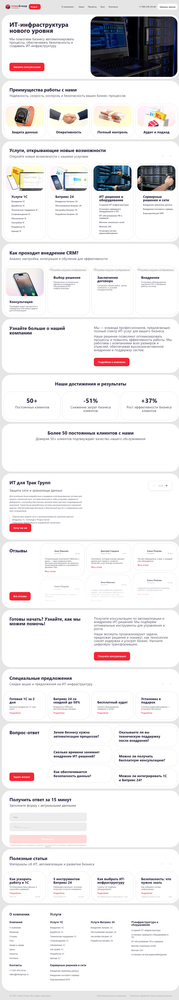
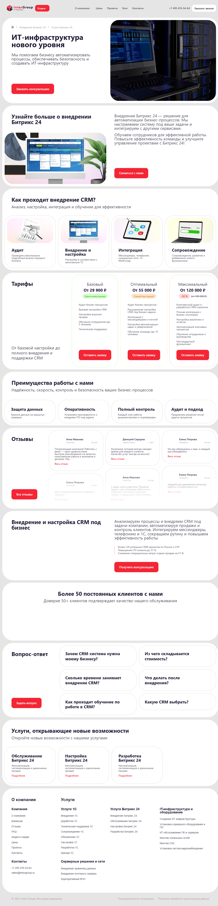

# 🎯 Bitrix Introduction - Dynamic Service Pages

## 📚 What is this?

Project for implementing **dynamic service page templates** in 1C-Bitrix.

Instead of hardcoded HTML pages, content is managed through the **Bitrix admin panel** — you create a service in an info-block, and it is automatically rendered with your markup.

---

## 📸 Screenshots

**Home page** (static template from `layout/index.html`):



**Service page** (static template from `layout/services.html` — the same markup rendered dynamically by the Bitrix template):



---

## 🗂️ Project Structure

```
layout/                      # Static HTML templates (source files)
├── index.html              # Home page
├── services.html           # Service page template
└── assets/                 # Images, styles, scripts

local/                       # Files for Bitrix
├── templates/
│   └── main/
│       ├── header.php              # Site header (PHP)
│       ├── footer.php              # Site footer (PHP)
│       └── components/
│           └── bitrix/
│               ├── news.detail/
│               │   └── service_detail/
│               │       └── template.php    # 🎨 MAIN service page template
│               └── news.list/
│                   └── related_services/
│                       └── template.php    # 🔗 "Related services" block
└── services/
    ├── bitrix24/
    │   └── implementation/
    │       └── index.php       # "Bitrix 24 Implementation" page
    └── 1c/
        └── support/
            └── index.php       # "1C Support" page
```

---

## 📖 Documentation

### 🚀 **Quick Start**

1. **Read:** [BITRIX_SETUP_GUIDE.md](BITRIX_SETUP_GUIDE.md) — full 400+ line instructions
2. **Use:** [PROPERTIES_CHECKLIST.md](PROPERTIES_CHECKLIST.md) — cheat sheet with the full property list

---

### 📝 **What the guide covers:**

✅ Creating the "Service Catalog" info-block  
✅ List of all 16 properties (with examples)  
✅ Creating sections (1C, Bitrix 24, IT infrastructure...)  
✅ Filling in the first service "Bitrix 24 Implementation"  
✅ Setting up SEF URLs (pretty URLs)  
✅ Copying files to the server  
✅ Troubleshooting common problems

---

## 🎨 Solution Highlights

### 1️⃣ **10 sections on the page:**

| # | Section | Data type | Where it is filled |
|---|---------|-----------|--------------------|
| 1 | Hero (main screen) | Dynamic | Properties: HERO_TITLE, HERO_DESCRIPTION, HERO_IMAGE |
| 2 | About the company | Dynamic | Property ABOUT_TITLE + DETAIL_TEXT field |
| 3 | Work process | Dynamic | Properties: PROCESS_TITLE, PROCESS_STEPS (list), PROCESS_STEPS_DESC |
| 4 | Pricing plans | Dynamic | Property TARIFFS (JSON, 3 values) |
| 5 | Advantages | **Static** | Same for all services |
| 6 | Testimonials | **Static** | Same for all services |
| 7 | Ready-to-start | Dynamic | Properties: READY_TITLE, READY_DESCRIPTION, READY_LIST |
| 8 | Clients | **Static** | Same for all services |
| 9 | FAQ (6 cards) | Dynamic | Properties: FAQ_QUESTIONS (list), FAQ_ANSWERS (list) |
| 10 | Related services | **Auto** | Automatically picked from the same category |

---

### 2️⃣ **Smart "Related Services" section**

Automatically shows **3 services from the same category**, excluding the current page.

**Example:** On the "Bitrix 24 Implementation" page → shows "Bitrix 24 Maintenance", "Bitrix 24 Configuration", "Bitrix 24 Development"

**Code (already implemented in the template):**

```php
// Filter picks services from the same section, excluding the current one
$arRelatedFilter = array(
    "SECTION_ID" => $arResult["IBLOCK_SECTION_ID"],
    "!ID" => $arResult["ID"]
);
```

---

### 3️⃣ **JSON for pricing plans**

Pricing plans are stored in JSON format (easy to edit):

```json
{
  "name": "Basic",
  "price": "From 29 900 ₽",
  "badge": "Price below market",
  "old_price": "",
  "features": [
    "Business process audit",
    "Basic CRM setup",
    "Sales pipeline setup"
  ]
}
```

For a **strikethrough price** (3rd plan):

```json
{
  "name": "Maximum",
  "price": "From 120 000 ₽",
  "badge": "-50%",
  "old_price": "(from 180 000 ₽)",
  "features": [...]
}
```

---

## 🔧 Configuration in the Bitrix Admin Panel

### Step 1: Create an info-block

- **Type:** Services (`services`)
- **Name:** Service Catalog
- **Symbolic code:** `service-catalog`

### Step 2: Add 16 properties

See the full list in [PROPERTIES_CHECKLIST.md](PROPERTIES_CHECKLIST.md)

### Step 3: Create sections

- `1c` → 1C Services
- `bitrix24` → Bitrix 24 Services
- `it-infrastructure` → IT Infrastructure
- `server-solutions` → Server Solutions

### Step 4: Add services

- Name: `Bitrix 24 Implementation`
- Symbolic code: `bitrix24-implementation`
- Section: `Bitrix 24 Services`
- Fill in all 16 properties

---

## 📂 How to Add a New Service?

### Option 1: Via the admin panel (recommended)

1. Go to **Content → Info-blocks → Service Catalog**
2. Click **"Add element"**
3. Fill in all fields and properties
4. Save

### Option 2: Create a file manually

1. Create a folder `/services/new-category/new-service/`
2. Copy `index.php` from the example there
3. Change the parameters:
   - `ELEMENT_CODE` → service symbolic code
   - `SECTION_CODE` → section symbolic code
   - `$APPLICATION->SetTitle()` → page title

---

## 🎯 What's Next?

After configuring the admin panel:

1. ✅ Create new services **without programming**
2. ✅ Edit texts and images via the admin panel
3. ✅ Add sections and categories
4. ✅ Scale the structure infinitely

**Service URLs:**

- `/services/bitrix24/implementation/` — Bitrix 24 Implementation
- `/services/1c/support/` — 1C Support
- `/services/IT-infrastructure-and-equipment/creation/` — IT Infrastructure Creation

---

## 🛠️ Technologies

- **1C-Bitrix** (CMS)
- **PHP** (server-side logic)
- **HTML/CSS/JS** (markup from `layout/`)
- **Info-blocks** (structured data)
- **Components** `bitrix:news.detail`, `bitrix:news.list`

---

## 📞 Contacts

If anything is unclear — read the guide in [BITRIX_SETUP_GUIDE.md](BITRIX_SETUP_GUIDE.md) or ask questions! 🚀

---

## 🎉 Good luck with the implementation
